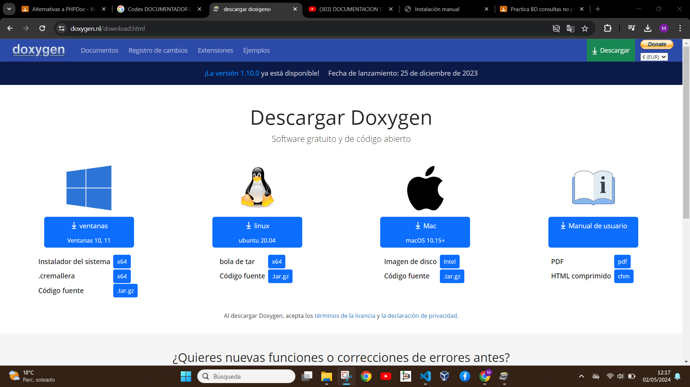

# Alternativas a PHPDoc - Vuelve a generar documentación

En  mi caso he elegido Doxygen para documentar mi código en primer lugar he descargado desde la [pagina oficial](https://www.doxygen.nl/download.html) el software mencionado:

una vez descargado lo instalamos y cuando ya este lo abrimos

para esta practica vamos a usar una practica del modulo de programacion de base de datos mysql (consultas) en php ubicada en kla carpeta Mohamed_ahmed_maimon_1daw

 sleccionamos la carpeta de nuestro proyecto la carpeta donde va acorrer doxygen y la carpeta de nombre salida donde obtendremos nuestro resultado

podemos sellecionar el color de nuestro html resultado

una vez seleccionados todos los parametros le damos run para que genere el resultado

vamos a nuestra carpeta Mohamed_Ahmed_Maimon_1DAW

vamos a nuestra carpeta Mohamed_Ahmed_Maimon_1DAW/SALIDA 

vamos a nuestra carpeta Mohamed_Ahmed_Maimon_1DAW/SALIDA/HTML

ABRIMOS NUESTRO HTML Y EL RESULTADO ES EL QUE SE VE EN EL VIDEO:

[DOCUMENTACION CON DOXYGEN](https://youtu.be/ORUHbMHhDmg)
